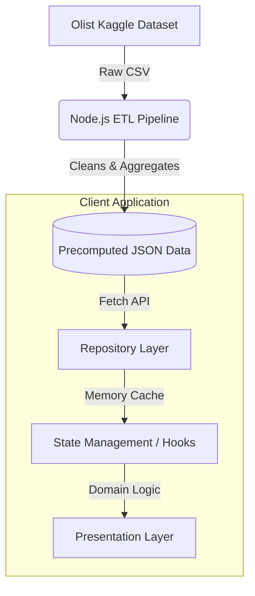
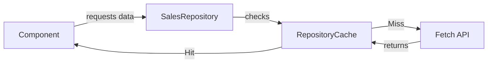

# System Architecture

SalesSphere is engineered using a strict separation of concerns, ensuring the UI remains decoupled from the data fetching logic. This document outlines the high-level architecture of the application.

## High-Level Architecture

The system is built on four primary layers:



### 1. The Data Layer (ETL)
We do not query a live database. Instead, raw CSVs are processed at build-time by an ETL pipeline into optimized JSON documents (`factSales.json`, `products.json`, etc.). These files act as our read-only data warehouse, served directly via Vite's static asset pipeline.

### 2. The Repository Layer
Components **never** make HTTP requests. Instead, they interact with the Repository Layer.



The `SalesRepository` provides strict TypeScript contracts (e.g., `getSales()`, `getProducts()`). It abstracts away the network layer. If we transition to a GraphQL API in the future, only the Repository changes.

### 3. State & Analytics Layer
We use **Zustand** for global state. The store (`useDashboardStore`) invokes the Repository and manages loading/error states. 

On top of the state, we use specialized custom hooks (e.g., `useSalesAnalytics`) that act as our domain logic layer. These hooks consume the raw arrays from the store and compute metrics, KPIs, and timeseries arrays specifically formatted for Recharts.

```mermaid
graph TD
    State[Zustand Store] -->|Raw FactSales[]| Hook[useSalesAnalytics]
    Hook -->|Aggregates| KPI[KPI Data]
    Hook -->|Groups by Month| TS[Timeseries Data]
```

### 4. Presentation Layer
The UI is modular, lazy-loaded, and highly visual.
- **AppShell**: Handles global layout, sidebar, and routing.
- **Feature Modules**: Domain-specific pages (Overview, Revenue, Products) lazy-loaded via `React.lazy`.
- **Widgets**: Reusable composed UI blocks (e.g., `DataTable`, `AlertCenter`).
- **Design System**: Fundamental atoms (Buttons, Cards, Skeletons) styled with Tailwind CSS.

## Key Architectural Principles

1. **Protect the Main Thread**: All heavy sorting, grouping, and merging of 100k+ records is pushed upstream to the ETL pipeline.
2. **Progressive Enhancement**: Using `<Suspense>` and Route Splitting, the user sees the App Shell instantly, while heavy chart chunks load asynchronously in the background.
3. **Single Source of Truth**: The Repository is the only entity that knows how to fetch data. Zustand is the only entity that holds global data. Components are purely for presentation.
