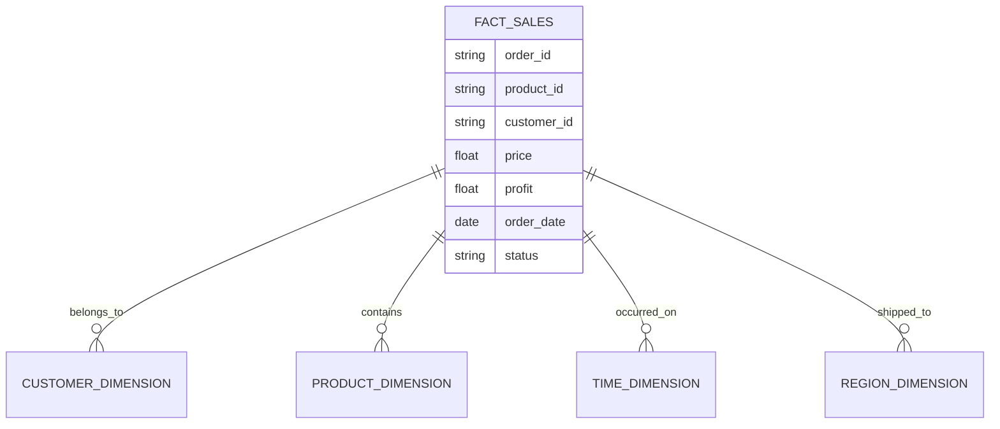

# Data Model & Schema

SalesSphere transforms a complex relational structure (the Olist Dataset) into a denormalized Star Schema optimized for UI rendering and analytics filtering.

## The Raw Dataset
We utilize the public [Brazilian E-Commerce Public Dataset by Olist](https://www.kaggle.com/datasets/olistbr/brazilian-ecommerce). It contains information on 100k orders from 2016 to 2018 made at multiple marketplaces in Brazil.

The raw data is relational:
- `orders` (timestamps, status)
- `order_items` (price, freight, product mapping)
- `products` (category, dimensions)
- `customers` (location, zip codes)

## The Star Schema
To enable instant, multi-dimensional filtering in the browser, the ETL pipeline denormalizes this data into a single, massive **Fact Table** (`factSales.json`).



By flattening the data into `FactSales[]`, our Zustand store can effortlessly pass this array into standard JavaScript `filter()` methods without executing complex client-side joins.

## Feature Engineering

### The Deterministic Margin Model
Because the Kaggle dataset does not contain wholesale cost data, we cannot natively calculate profit. Rather than generating random costs, we engineered a deterministic margin model based on the product category.

This ensures:
1. **Reproducibility**: The profit for a specific order is identical every time the app is built.
2. **Realism**: High-margin categories (Fashion) reflect real-world e-commerce trends compared to low-margin commodities (Electronics).

```json
{
  "method": "Category Margin Model",
  "overrides": {
    "electronics": 0.18,
    "furniture": 0.28,
    "fashion": 0.45
  }
}
```

## Precomputed Summaries
While the `factSales.json` file is powerful, it is too large (4-5MB) to load immediately. The ETL script generates precomputed summaries that power the initial landing page.

- **`dateDimension.json`**: Pre-aggregated revenue and profit grouped by `YYYY-MM-DD`. Allows the Sparkline charts to render without downloading 100k rows.
- **`kpiSummary.json`**: Contains exactly 4 numbers (Total Revenue, Total Profit, Total Orders, Active Customers). Load time: ~2ms.
