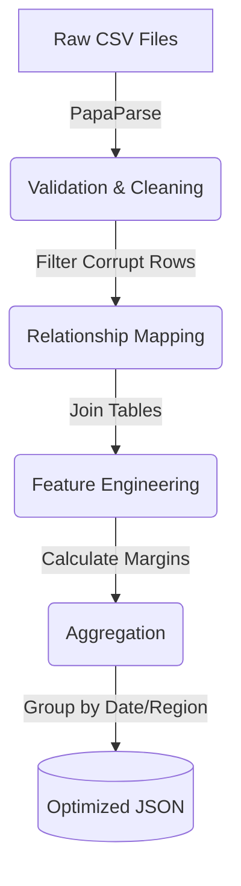

# ETL Pipeline

SalesSphere handles real-world e-commerce data from the Olist Kaggle dataset. Rather than forcing the browser to download and parse 100MB of relational CSV files, we built a deterministic ETL (Extract, Transform, Load) pipeline in Node.js that runs at build-time.

## The Pipeline Flow



### 1. Extraction
The script (`scripts/process-kaggle-data.js`) reads raw CSV files from `public/dataset/`:
- `olist_orders_dataset.csv`
- `olist_order_items_dataset.csv`
- `olist_products_dataset.csv`
- `olist_customers_dataset.csv`

We use `papaparse` with streaming enabled to keep memory usage low during processing.

### 2. Transformation
This is where the heavy lifting occurs:

- **Validation & Cleaning**: Orders without an `order_approved_at` timestamp or with an `unavailable` status are discarded. Missing values are coerced into defaults.
- **Relationship Mapping**: We perform in-memory joins. An Order Item is mapped to its parent Order, which is mapped to a Customer, which gives us geographic data (State/City). 
- **Feature Engineering (The Margin Model)**: Raw data only includes revenue (price). To calculate profit, we implement a **Deterministic Margin Model**. Instead of randomly generating a cost (which breaks reproducibility), we assign fixed margins based on product categories.

```javascript
const marginModel = {
  'electronics': 0.18,
  'furniture': 0.28,
  'fashion': 0.45,
  'sports': 0.32,
  'books': 0.22,
  'default': 0.25
};

const profit = price * marginModel[category];
```

### 3. Loading (Aggregation)
Instead of outputting one massive 100MB JSON file, we aggregate the data into specialized dimension files that the frontend can lazy-load:

- `factSales.json`: The core fact table containing only the necessary fields for charting.
- `dateDimension.json`: Pre-aggregated daily and monthly revenue/profit summaries.
- `kpiSummary.json`: High-level metrics required for the dashboard overview.
- `profitModel.json`: Metadata explaining the margin calculations used for auditing.

## Why Build-Time ETL?

1. **Browser Limits:** V8 engines in browsers struggle to parse massive datasets synchronously. It blocks the main thread, causing frozen UI and "Page Unresponsive" errors on lower-end devices.
2. **Instant Paint:** By pre-aggregating `kpiSummary.json`, the App Shell and Overview page can fetch a 2KB file and render instantly, deferring the loading of the 5MB `factSales.json` until the user actually requests a deep-dive chart.
3. **Analytics Integrity:** Pre-processing allows us to guarantee data integrity before the application is deployed. If the ETL script fails due to malformed data, the build fails, protecting the production environment.
