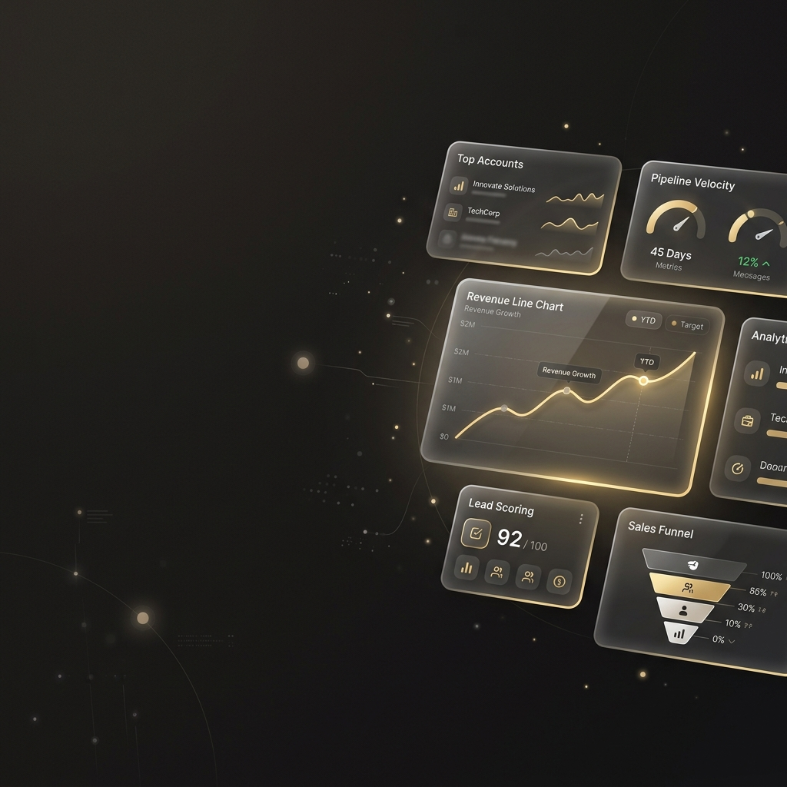
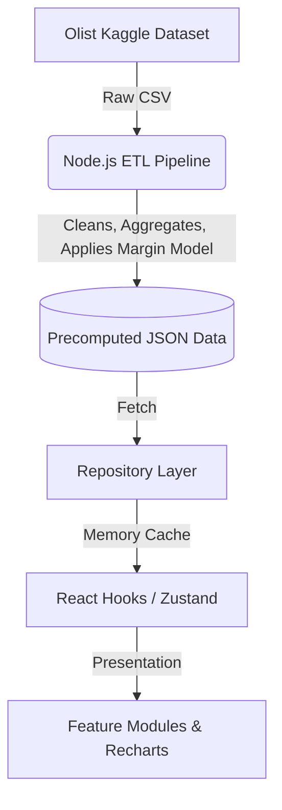

# SalesSphere



[](#)
[](#)
[](#)
[](#)
[](#)
[](#)
[](https://opensource.org/licenses/MIT)

**[🌐 Live Demo](#) | [📹 Demo Video](#) | [📄 Engineering Handbook](#documentation-handbook)**

**SalesSphere** is an enterprise-grade sales analytics dashboard built to process and visualize 100,000+ records of real-world e-commerce data. Designed with a strict focus on performance, architecture, and premium UX, this project serves as a masterclass in modern React engineering.

## Key Features

- ⚡ **Zero-Latency Data Fetching**: Utilizes a custom `RepositoryCache` to ensure sub-millisecond data delivery.
- 🏗️ **Deterministic ETL Pipeline**: A standalone Node.js pipeline processes raw Kaggle CSVs into highly optimized JSON aggregates, shifting the computational burden from the browser to build-time.
- 🎨 **Premium UX & Motion System**: Contextual skeletons, graceful error states, and a centralized Framer Motion token system provide a polished, app-like feel.
- 📊 **Virtualized Data Tables**: Custom `@tanstack/react-virtual` integration effortlessly handles massive data sets without dropping frames.
- 🚀 **Aggressive Code Splitting**: Route-level and component-level lazy loading keeps the initial JS bundle under 300KB.

## Architecture Overview



## Tech Stack

- **Framework**: React 19 + TypeScript + Vite
- **State Management**: Zustand
- **Styling**: Tailwind CSS v4 + Shadcn UI concepts
- **Data Visualization**: Recharts
- **Animation**: Framer Motion
- **Performance**: TanStack Virtual

## Quick Start

1. **Clone the repository:**
   ```bash
   git clone https://github.com/yourusername/salessphere.git
   cd salessphere
   ```

2. **Install dependencies:**
   ```bash
   npm install
   ```

3. **Run the ETL Pipeline (Optional if JSON is present):**
   ```bash
   npm run process-data
   ```

4. **Start the Development Server:**
   ```bash
   npm run dev
   ```

## Folder Structure

```text
src/
├── app/            # Application shell and routing
├── components/     # Reusable UI (design-system, charts, feedback)
├── config/         # App-wide configurations and module registry
├── features/       # Domain-driven feature modules (Revenue, Products, etc.)
├── hooks/          # React hooks for analytics and business logic
├── layouts/        # Page structures and navigation
├── repositories/   # Data fetching and caching layer
├── shared/         # Shared types and utilities
├── store/          # Zustand global state
├── styles/         # CSS and Motion tokens
└── widgets/        # Complex compositions (DataTable, AlertCenter)
```

## Documentation Handbook

This project includes a comprehensive engineering handbook documenting architectural choices:

- [ARCHITECTURE.md](./ARCHITECTURE.md) - Deep dive into the system design.
- [DECISIONS.md](./DECISIONS.md) - Why we made specific technical choices (e.g., Why Repository Pattern?).
- [ETL_PIPELINE.md](./ETL_PIPELINE.md) - Breakdown of the data transformation process.
- [DATA_MODEL.md](./DATA_MODEL.md) - Explanation of the Star Schema and Margin Model.
- [DESIGN_SYSTEM.md](./DESIGN_SYSTEM.md) - Typography, colors, and motion philosophy.
- [PERFORMANCE.md](./PERFORMANCE.md) - Bundle sizes, caching, and virtualization.
- [API.md](./API.md) - Repository pattern contracts.
- [DEPLOYMENT.md](./DEPLOYMENT.md) - Vercel deployment and CI/CD strategy.

## Roadmap

- [x] Build core UI and dashboard structure
- [x] Implement robust ETL pipeline for real data
- [x] Migrate to Repository Pattern with caching
- [x] Implement UX Polish (Skeletons, Motion, Toasts)
- [ ] Add e2e testing with Playwright

## License

MIT License. See [LICENSE](LICENSE) for more information.
