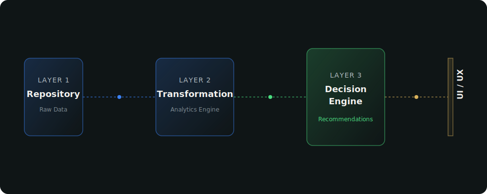

<div align="center">
  
  <h1>SalesSphere</h1>
  <p><strong>Enterprise Sales Intelligence Platform</strong></p>
  <p><em>Transforming operational sales data into explainable business decisions through contextual analytics and actionable recommendations.</em></p>
  <br />
</div>

## Philosophy

SalesSphere is built on the philosophy of **"Calm Enterprise Intelligence."**

1. **Every screen answers one business question.**
2. **Context before visualization.**
3. **Recommendations before exploration.**
4. **Pixels build trust.**

We move away from "dashboards" that are merely collections of charts, towards an application shell that models how executives think:

`Observe → Analyze → Understand → Decide → Act`

## Features

- **Executive Briefing**: Understand business health instantly through AI-generated natural language summaries, not just KPI numbers.
- **Explainable Recommendations**: Get AI-powered recommendations (e.g., "Liquidate Furniture Inventory") with direct business impact and supporting rationales.
- **Enterprise Design System**: A meticulously crafted 8pt grid interface with a bespoke color palette, refined typography (`Inter`, `Playfair Display`, `JetBrains Mono`), and subtle micro-animations that feel premium.
- **Workflow-driven Architecture**: Pages structured around decision flows (Overview, Performance, Products, Customers, Intelligence, Board Reports).

## Technology Stack

- **Framework**: React 18, TypeScript, Vite
- **Styling**: Vanilla CSS (CSS Variables) + Tailwind CSS (Strictly mapped to CSS Tokens)
- **Animation**: Framer Motion
- **Data Visualization**: Recharts (Customized and beautified)
- **Icons**: Lucide React
- **Routing**: React Router

## Design System

The application strictly adheres to a design system defined in `src/index.css`.
- **Spacing**: 8pt increments (`4px` micro, `8px` related, `16px` components, `24px` cards...)
- **Typography**: `Inter` (UI), `Playfair Display` (Hero statements), `JetBrains Mono` (Data)
- **Colors**: Deep surface (`#0F1516`), Premium card (`#141C1E`), Success/Warning/Danger/Info Semantic mapping.

## Architecture



## Installation

```bash
git clone https://github.com/yourusername/salessphere.git
cd salessphere
npm install
npm run dev
```

## Changelog

See [CHANGELOG.md](CHANGELOG.md) for a history of updates and releases.

<br />
<div align="center">
  <p>Built with intention and care.</p>
</div>
