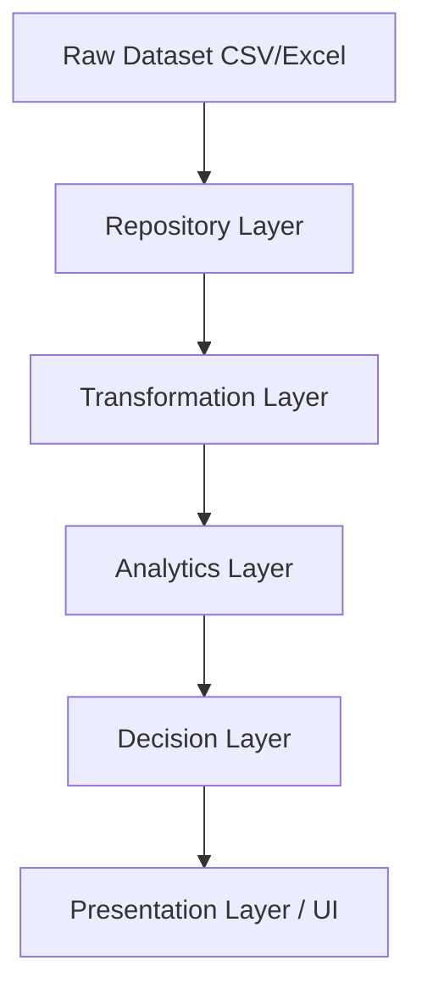

# SalesSphere — Enterprise Sales Intelligence Platform
*Engineering & Product Specification v5.0 (Final)*

## Executive Summary
SalesSphere is a modern Business Intelligence platform built to transform raw sales data into actionable business insights. The platform enables managers, analysts, and executives to monitor revenue, track KPIs, analyze sales trends, compare regional performance, identify top products, and generate AI-assisted business insights. The application emphasizes usability, performance, accessibility, and scalable architecture, designed to feel like Stripe Analytics × Shopify Analytics × Power BI.

## Product Scope
### In Scope
- Sales analytics dashboard
- Revenue & Product performance analysis
- Regional performance & Customer insights
- Interactive filtering & Report exports
- AI-assisted business insights

### Out of Scope (v1.0)
- User authentication & Multi-tenant organizations
- Real-time streaming
- Inventory management & CRM functionality
- Payment processing
- Machine learning forecasting

## Project Architecture


## Engineering Principles
- **Single Responsibility**: Every component has one responsibility.
- **Data Flows Down**: UI never performs business calculations.
- **Repository First**: Components never fetch raw data directly.
- **Analytics First**: Business metrics are calculated in the Analytics Layer.
- **Decision Layer**: Business rules determine KPI status, alerts, risk flags, and insights.
- **Presentational Components**: Charts only render data. They never calculate it.
- **Composition Over Inheritance**: Large pages are assembled from reusable components.
- **Design Token Driven**: No hardcoded spacing, colors, or typography. Everything comes from the design system.

## Analytics Dictionary
A single source of truth for all business calculations:
- **Revenue**: Sum of Sales (`Σ Sales`)
- **Profit**: Sum of Profit (`Σ Profit`)
- **Profit Margin**: `(Profit / Revenue) × 100`
- **Average Order Value (AOV)**: `Revenue / Number of Orders`
- **Growth %**: `((Current Period - Previous Period) / Previous Period) × 100`
- **Top Product**: Highest Revenue
- **Best Region**: Highest Revenue
- **Customer Lifetime Value (LTV)**: Sum of purchases by customer
- **Conversion Rate**: `Closed Orders / Total Opportunities`

## Design Tokens (Design System)
**Colors**
- Background: `#101317`
- Surface: `#171B22`
- Card: `#1F2630`
- Primary Text: `#F5F5F5`
- Secondary Text: `#AEB4C0`
- Success: `#3FA96B`
- Warning: `#E5B25D`
- Danger: `#E06B6B`
- Info: `#4E8EF7`

**Spacing, Radius, Shadow & Animation**
- Spacing: `4, 8, 12, 16, 24, 32, 48, 64, 96`
- Radius: `8, 12, 16, 20, 24`
- Shadow: `sm, md, lg`
- Animation: `Fast (150ms)`, `Normal (250ms)`, `Slow (400ms)`

## Component Inventory
- `AppShell`, `Sidebar`, `TopNavigation`, `SearchBar`, `DateRangePicker`
- `MetricCard`, `Sparkline`, `RevenueChart`, `SalesChart`, `RegionalChart`, `DonutChart`
- `FilterPanel`, `OrdersTable`, `InsightCard`
- `LoadingSkeleton`, `EmptyState`, `ErrorState`, `ExportButton`, `StatusBadge`, `Tooltip`, `ChartLegend`, `Pagination`, `CommandPalette (Future)`

## Dataset Schema
**Orders**
- Order ID, Order Date, Customer ID, Product ID, Category, Quantity, Unit Price, Discount, Sales, Profit, Region, State, Segment
**Derived Metrics**
- Revenue, Profit Margin, Average Order Value, Growth %, Monthly Revenue, Quarterly Revenue, Top Products, Top Customers, Regional Performance

## Dashboard Principles
Every screen must answer:
1. What happened?
2. Why did it happen?
3. What should I do next?

No chart exists without a clear business purpose. Every visualization supports filtering. Every metric has contextual comparison.

## Dashboard Goals (Business Questions)
1. How much revenue did we generate?
2. Are sales increasing?
3. Which products perform best?
4. Which regions underperform?
5. Which customers contribute the most?
6. Are targets being achieved?
7. What actions should management take?

## Navigation (Information Architecture)
- Overview, Sales, Revenue, Products, Customers, Regions, Reports, Settings

## Dashboard Blueprint
```text
┌─────────────────────────────────────────────────────────────┐
│ Top Navigation                                              │
│ Logo | Search | Date Range | Export | Notifications | Profile │
└─────────────────────────────────────────────────────────────┘

┌─────────────────────────────────────────────────────────────┐
│ KPI Overview                                                │
│ Revenue | Profit | Orders | AOV | Growth | Customers        │
└─────────────────────────────────────────────────────────────┘

┌─────────────────────────────────────────────────────────────┐
│ Revenue Analytics                                           │
│ Large Revenue Trend + Forecast                              │
└─────────────────────────────────────────────────────────────┘

┌──────────────────────────────┬──────────────────────────────┐
│ Product Performance          │ Regional Performance         │
│ Horizontal Bar               │ Bar / Map                    │
└──────────────────────────────┴──────────────────────────────┘

┌──────────────────────────────┬──────────────────────────────┐
│ Category Breakdown           │ Customer Insights            │
│ Donut                        │ Top Customers                │
└──────────────────────────────┴──────────────────────────────┘

┌─────────────────────────────────────────────────────────────┐
│ Business Insights (AI-assisted)                             │
└─────────────────────────────────────────────────────────────┘

┌─────────────────────────────────────────────────────────────┐
│ Orders Table                                                │
└─────────────────────────────────────────────────────────────┘
```

## Feature Priorities
### P0 (Must Have)
- KPI Cards, Revenue Trend, Product Performance, Regional Analysis, Orders Table, Global Filters
### P1 (Should Have)
- Business Insights (AI-assisted), Export Reports, Saved Views
### P2 (Nice to Have)
- Forecasting, Goal Tracking, Scheduled Reports

## Implementation Milestones (Development Order)
1. **Foundation**: React + Vite + TypeScript, Tailwind CSS v4, shadcn/ui, Zustand, Recharts, Framer Motion, TanStack Table.
2. **Design Tokens**: Implement predefined colors, spacing, and typography primitives.
3. **AppShell**: Build the core layout structure and navigation.
4. **Repository Layer**: Fetching raw data.
5. **Transformation Layer**: Cleaning and typing data.
6. **Analytics Layer**: Implement Analytics Dictionary formulas.
7. **Decision Layer**: Evaluate KPI statuses, risk flags, and insight generation.
8. **Global Store**: Shared Zustand state for Date, Region, Category filters.
9. **Reusable Components**: Build charts, tables, cards, and UX states (Loading, Empty, Error).
10. **Dashboard Composition**: Assemble the dashboard according to the Blueprint.
11. **Performance**: Lazy-load routes, virtualize tables.
12. **Documentation**: README, Architecture diagram, Design System.

## Testing Strategy
- **Unit Tests**: Analytics calculations & Decision rules.
- **Component Tests**: Charts, Tables, Filters.
- **Integration Tests**: Repository → Analytics → UI.
- **Manual & Visual Testing**: Responsive, Accessibility, Performance, Screenshots.

## Non-Functional Requirements & Success Criteria
- **Performance**: First Paint < 1.5s, Interactive < 2s. Lighthouse >95.
- **Accessibility**: WCAG AA, Keyboard navigation, Focus indicators.
- **Success Criteria**: Import CSV successfully. User understands dashboard within 10 seconds.
- **Definition of Done**: UI matches design tokens. Responsive. Accessible. Uses repository layer. No hardcoded values.

## Roadmap
- **v1.0**: Analytics Dashboard
- **v1.1**: Forecasting & Scheduled Reports
- **v2.0**: Real-time Dashboard
- **v3.0**: Predictive Analytics

---

> [!IMPORTANT]
> **User Review Required:** The SalesSphere Specification v5.0 is completed! We have established an ironclad foundation. Hit **Proceed** to officially kick off **Milestone 1: Foundation**.
